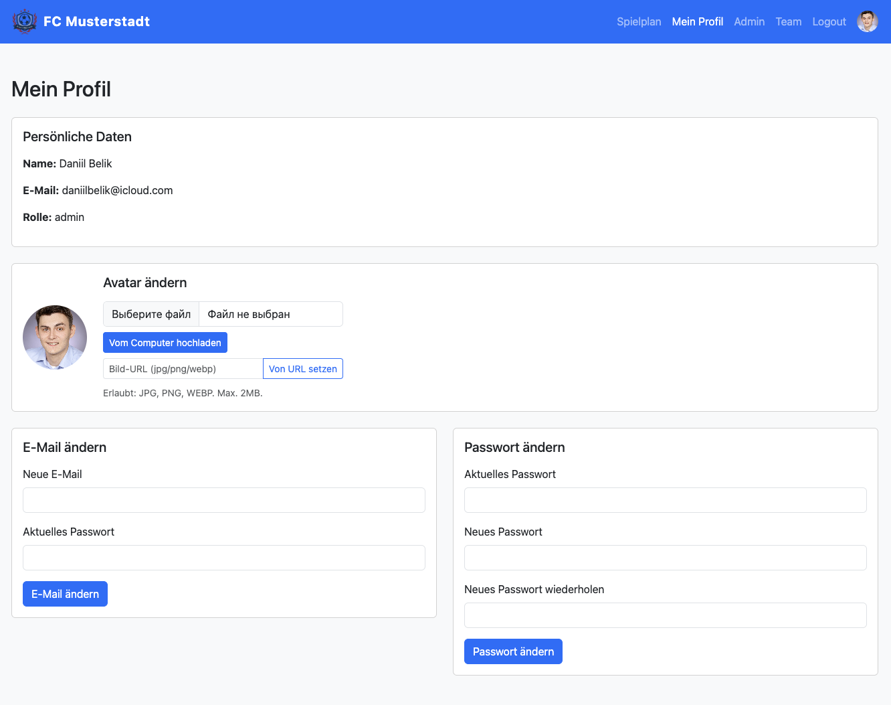
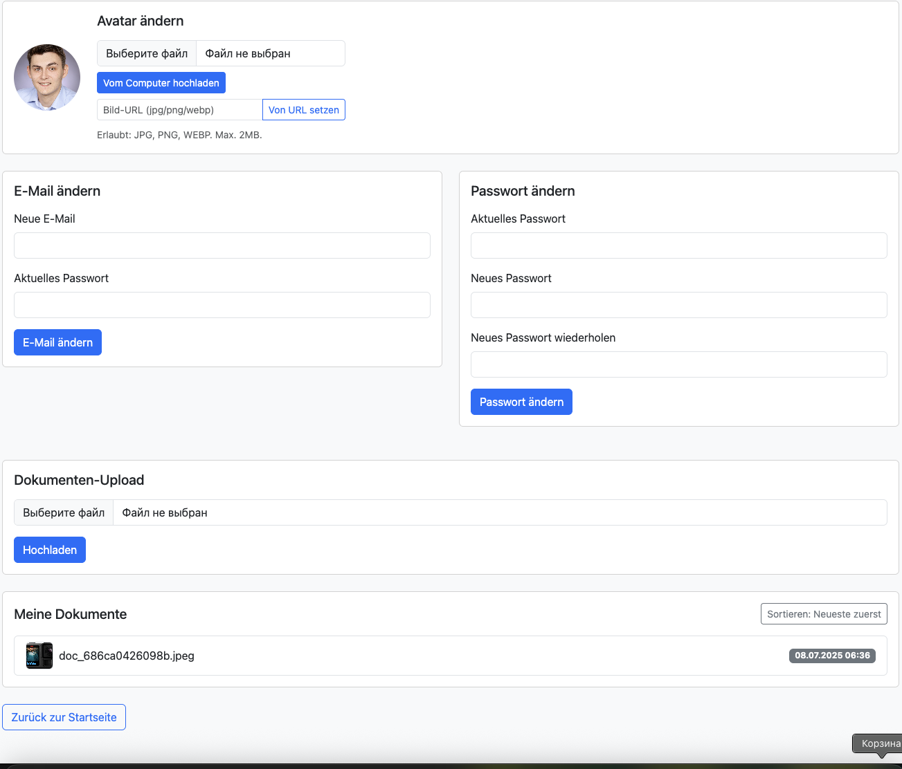
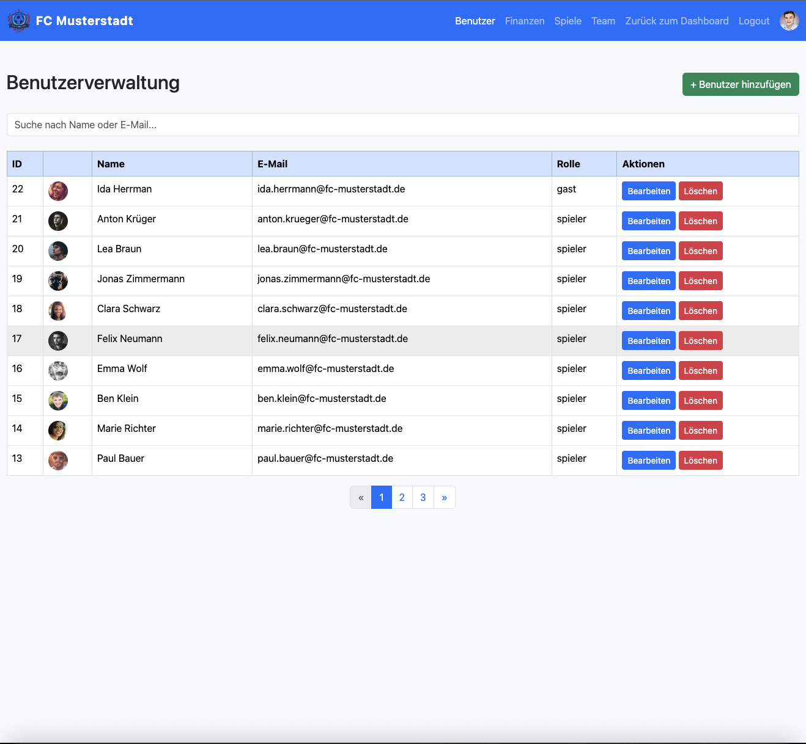
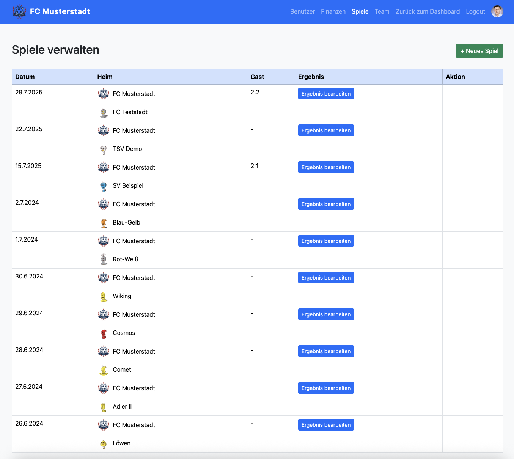
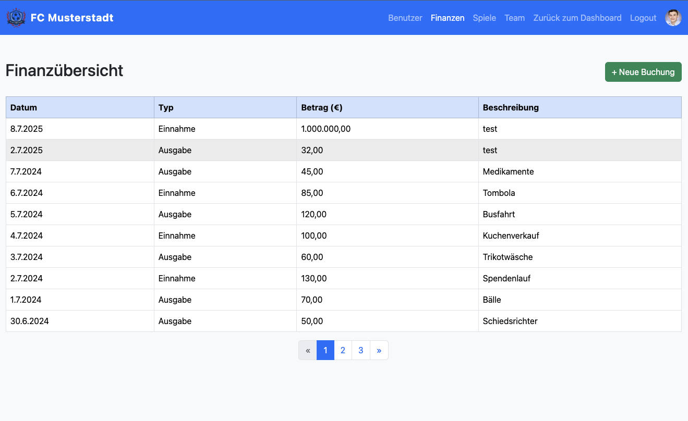
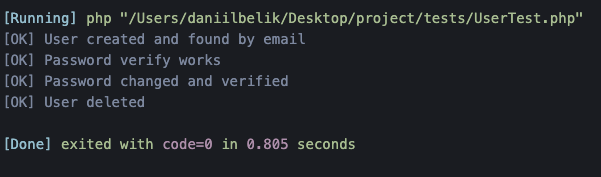
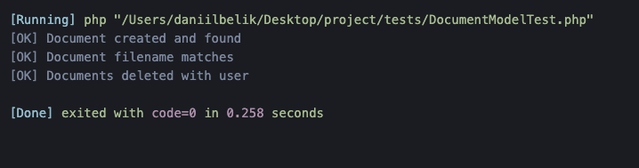

# ⚽ Vereinsmanagement-System FC Musterstadt

Ein webbasiertes, sicheres und modernes Vereinsmanagement-System für den Amateur-Fußballverein **FC Musterstadt**.
Verwaltung von Mitgliedern, Spielen, Finanzen und Dokumenten – alles in einer intuitiven Oberfläche.

---

## 📂 Projektstruktur

```
project/
│
├── app/                # MVC: Controller, Models, Views, Core-Klassen
│   ├── controllers/    # Controller für alle Bereiche (z.B. Admin, Profile, Team)
│   ├── models/         # Datenbankmodelle (User, Match, Document, ...)
│   ├── views/          # Alle HTML/PHP-Templates (Frontend, Admin, Partials)
│   └── core/           # Basisklassen (MVC, DB, Security, Flash, ...)
│
├── public/             # Webroot (index.php, CSS, JS, Uploads)
│   ├── uploads/        # Benutzer- und Team-Avatare, Dokumente
│   └── css/            # Stylesheets
│
├── config/             # Konfigurationsdateien (z.B. Datenbank)
│
├── tests/              # Einfache Unit-Tests für Models
│
└── README.md           # Diese Anleitung
```

---

## 🚀 Installation & Start

1. **Repository klonen**

   ```bash
   git clone <repo-url>
   cd project
   ```

2. **Datenbank anlegen**  
   Lege eine MySQL-Datenbank an und importiere die Tabellen (siehe unten).

3. **Konfiguration**

   - Passe `config/database.php` mit deinen DB-Zugangsdaten an.

4. **Server starten**
   ```bash
   php -S localhost:8000 -t public
   ```
   Öffne [http://localhost:8000](http://localhost:8000) im Browser.

---

## 🗄️ Datenbankstruktur

**Tabelle `users`**

```sql
CREATE TABLE users (
    id INT AUTO_INCREMENT PRIMARY KEY,
    name VARCHAR(100) NOT NULL,
    email VARCHAR(255) NOT NULL UNIQUE,
    password_hash VARCHAR(255) NOT NULL,
    role ENUM('admin','spieler','gast') NOT NULL DEFAULT 'spieler',
    avatar VARCHAR(255),
    created_at TIMESTAMP DEFAULT CURRENT_TIMESTAMP
);
```

**Tabelle `matches`**

```sql
CREATE TABLE matches (
    id INT AUTO_INCREMENT PRIMARY KEY,
    date DATE NOT NULL,
    home_team VARCHAR(100) NOT NULL,
    away_team VARCHAR(100) NOT NULL,
    result VARCHAR(20) DEFAULT NULL,
    away_team_avatar VARCHAR(255)
);
```

**Tabelle `documents`**

```sql
CREATE TABLE documents (
    id INT AUTO_INCREMENT PRIMARY KEY,
    user_id INT NOT NULL,
    filename VARCHAR(255) NOT NULL,
    uploaded_at TIMESTAMP DEFAULT CURRENT_TIMESTAMP,
    FOREIGN KEY (user_id) REFERENCES users(id) ON DELETE CASCADE
);
```

**Testdaten für Spieler**

```sql
-- 20 Spieler, Passwort: spieler123
INSERT INTO users (name, email, password_hash, role) VALUES
('Spieler 1', 'player1@fc-musterstadt.de', '$2y$10$...', 'spieler'),
...
('Spieler 20', 'player20@fc-musterstadt.de', '$2y$10$...', 'spieler');
```

---

## 🏆 Funktionsübersicht

### Öffentlicher Bereich

- **Spielplan**: Alle Spiele mit Logos, Gegnern und Ergebnissen
- **Team-Seite**: Mannschaftsübersicht mit Fotos und Infos  
  

### Mitgliederbereich

- **Profilverwaltung**: Persönliche Daten, Avatar ändern, Passwort/E-Mail ändern  
  
- **Dokumentenverwaltung**: Upload, Vorschau (Bilder, PDF), Sortierung  
  

### Admin-Bereich

- **Benutzerverwaltung**: Suchen, Bearbeiten, Löschen, Rollen, Avatare  
  
- **Spiele verwalten**: Hinzufügen, Bearbeiten, Gegner-Logos  
  
- **Finanzen**: Einnahmen/Ausgaben, Filter, CSV-Export, Pagination  
  

### Sicherheit & Technik

- Passwort-Hashing (BCrypt)
- CSRF-Schutz, Prepared Statements (PDO)
- Rollenbasiertes Rechtemanagement (RBAC)
- XSS-Schutz, Validierung
- Responsive Design (Bootstrap 5)

### Tests

- Einfache Unit-Tests für User- und Dokumentenmodelle  
    
  

---

## 🧪 Testing

- **Unit-Tests ausführen:**
  ```bash
  php tests/UserTest.php
  php tests/DocumentModelTest.php
  ```
  Ausgabe: `[OK]` oder `[FAIL]` pro Testfall.

---

## ⚙️ Konfiguration

- **DB-Zugang:**  
  In `config/database.php` anpassen:

  ```php
  return [
      'dsn' => 'mysql:host=localhost;dbname=fc_musterstadt;charset=utf8mb4',
      'user' => 'deinuser',
      'pass' => 'deinpass'
  ];
  ```

- **Uploads:**  
  Alle Avatare und Dokumente werden in `public/uploads/` gespeichert.

---

## 📸 Screenshots

1. **Teamübersicht**  
   
2. **Profil & Dokumente**  
     
   
3. **Finanzen**  
   
4. **Spiele verwalten**  
   
5. **Benutzerverwaltung**  
   
6. **Unit-Tests**  
     
   

---

## 💡 Hinweise

- **Admin-Login:**  
  Standardmäßig gibt es keinen Admin. Lege einen Benutzer mit Rolle `admin` direkt in der DB an.
- **Passwort für Testspieler:**  
  `spieler123`
- **Uploads:**  
  Max. 2MB für Avatare, 5MB für Dokumente.

---

## 📜 Lizenz

MIT (oder eigene Lizenz eintragen)

---

**Erstellt für INF 1 Fallstudie I, Klasse: FAG 46, Dozent: Milovan Kristo, Abgabe: 11.07.2025**

---

**Wenn du weitere Screenshots oder spezielle Hinweise einfügen möchtest, gib Bescheid!**
